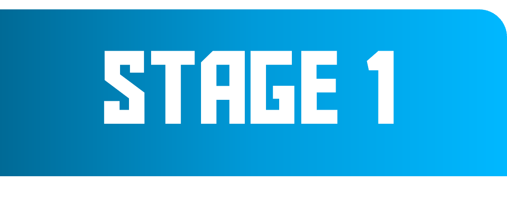

<h1 align="center">Roadmap Into Weeks </h1> 

  
 ## It's the same roadmap, but divided into weeks with an average studying rate of 6 hours per week. 
  
 ### This roadmap is divided into 4 levels: 
 - [Stage 1](#stage-1): you get a basic understanding of the prerequisites, data cleaning, and git. 
 - [Stage 2](#stage-2): learn visualizing, Tableau, SQL, and web scraping. 
 - [Stage 3](#stage-3): dive into ML and Math 
 - [Stage 4](#stage-4): where we learn DL, CV, and NLP. 
 
   
 
 > You should make a task after each week, and some projects after each stage. 
  
<h2 id="stage-1"></h2>

| 📅 Week | 🔖 Topics            | 📚 Resources                                  | 📝 Task                                |
|------|--------------------|--------------------------------------------|-------------------------------------|
| 1    | 📊 Descriptive Statistics | 📌**Main Resources**  - [Udacity course (intro to descriptive statistics)](https://www.udacity.com/enrollment/ud827)   💡**Additional Resources**   - [Simple Learning Pro(Statistics1)](https://youtube.com/playlist?list=PL0KQuRyPJoe6KjlUM6iNYgt8d0DwI-IGR&si=-2vYyjueFXxP-zx4)   - [Kaggle Article](https://www.kaggle.com/discussions/getting-started/198641)   - [Data Camp cheat_sheat](https://www.datacamp.com/cheat-sheet/descriptive-statistics-cheat-sheet) | 📝[Statistics Task1](https://colab.research.google.com/drive/1_yLcOd7st7X6KuwYEFpZ1j3vJmVI8cBT?usp=sharing) |
| 2    | 🐍Python Basics | 📌**Main Resources**  - [udacity Course(Intro to Python Programming)](https://www.udacity.com/course/introduction-to-python--ud1110 )    💡**Additional Resources**   - [Kaggle Course](https://www.kaggle.com/learn/python)   - [SoloLearn (intro to Python)](https://www.sololearn.com/en/learn/courses/python-introduction)  - [SoloLearn (Intermediate Python)](https://www.sololearn.com/en/learn/courses/python-intermediate) | 📝[Python Task1](https://colab.research.google.com/drive/1ChRJZ1qAsoCIA10YtMvWVKFBIPdWHZ_u?usp=sharing)   📝[Python Task2](https://drive.google.com/file/d/11gNjyWxI1JShycED8Zmr6VlNqSjQehUM/view?usp=sharing)   📝[Data Camp Assessement](https://assessment-v2.datacamp.com/coding-for-production-python)|
| 3    | 🐍OOp in Python | 📌**Main Resources**  - [Data Camp Course](https://app.datacamp.com/learn/courses/object-oriented-programming-in-python)   💡**Additional Resources**  - [kaggle Article (OOP1)](https://www.kaggle.com/discussions/getting-started/428038)   - [Kaggle Article (OOP2)](https://www.kaggle.com/discussions/getting-started/428640)| 📝[Building a Retail Inventory Management System (Data Camp Project)](https://app.datacamp.com/learn/projects/2426) |
| 4    | 🔢Numpy | 📌**Main Resources**  - [Data Camp(Numpy)](https://app.datacamp.com/learn/courses/introduction-to-numpy)   💡**Additional Resources**  - [Comprehensive Numpy Notebook](https://github.com/ageron/handson-ml3/blob/main/tools_numpy.ipynb)   - [Numpy Documentation](https://numpy.org/learn/)| 📝[Practice on Numpy](https://practice.datacamp.com/p/601)|
| 5    |  🐼Pandas  |  📌**Main Resources**  - [Corey Schafer (Pandas tutorial)](https://www.youtube.com/playlist?list=PL-osiE80TeTsWmV9i9c58mdDCSskIFdDS)  - [Medium Article (Data Cleaning)](https://towardsdatascience.com/the-ultimate-guide-to-data-cleaning-3969843991d4) 💡**Additional Resources** - [Comperehensive Notebook](https://github.com/ageron/handson-ml3/blob/main/tools_pandas.ipynb)  [Pandas Documentation](https://pandas.pydata.org/docs/)| 📝[Examining the History of Lego Sets(Data Camp Project)](https://app.datacamp.com/learn/projects/2378) | 
|  6    |  🔣 Regular Expressions (Regex)   🧹 Data Cleaning  | 📌**Main Resources**  - [Datacamp Course(Regex in Python)](https://app.datacamp.com/learn/courses/regular-expressions-in-python) - [Datacamp Course(Cleaning Data)](https://app.datacamp.com/learn/courses/cleaning-data-in-python)  💡**Additional Resorces** - [Python Regex Documentation](https://www.w3schools.com/python/python_regex.asp) - [Medium Article(Data Cleaning)](https://bit.ly/3vXqybR) - [Kaggle Course(Data Cleaning)](https://www.kaggle.com/learn/data-cleaning)  |  📝Clean the [candy data](https://drive.google.com/drive/folders/1Nxi3h7cxIFDJ1Zr8LajnHYDA2cuLDAK2)  |   

 
<h2 id="stage-2"></h2>

| 📅 Week | 🔖 Topics            | 📚 Resources                                  | 📝 Task                                |
|------|--------------------|--------------------------------------------|-------------------------------------|
|  1     |  📈Matplotlib  |  📌**Main Resources**  - [Corey Schafer (Matplotlib tutorial)](https://youtube.com/playlist?list=PL-osiE80TeTvipOqomVEeZ1HRrcEvtZB_&si=I3gLknPrRuBYvuIo) 💡**Additional Resources** - [Data Camp Blog(Data Visualization)](https://www.datacamp.com/blog/what-is-data-visualization-a-guide-for-data-scientists)  |  📝[Investigating Netflix Movies(Datacamp Project)](https://app.datacamp.com/learn/projects/investigating_netflix) 📝Make a notebook on Kaggle[9000+ Movies dataset](https://www.kaggle.com/datasets/disham993/9000-movies-dataset)  |
|  2    |  🌊Seaborn  |  📌**Main Resources**  - [DataCamp(Data Visualization with Seaborn)](https://app.datacamp.com/learn/courses/introduction-to-data-visualization-with-seaborn) - [Intermediate Data visualization with seaborn](https://app.datacamp.com/learn/courses/intermediate-data-visualization-with-seaborn)  💡**Additional Resources** - [Seaborn Summary](https://github.com/Ahmed-Hereiz/My-Summmary/blob/main/Seaborn%20More%20Visualizations/More%20visualizations.ipynb)  | 📝Make a Kaggle notebook [Airline Passenger satisfaction](https://www.kaggle.com/datasets/teejmahal20/airline-passenger-satisfaction/data)  |
|  3    |  🔎Exploratory Data Analysis (EDA)  |  📌**Main Resources**  - [Datacamp Course (EDA)](https://app.datacamp.com/learn/courses/exploratory-data-analysis-in-python) - [Medium Article(EDA)](https://towardsdatascience.com/exploratory-data-analysis-8fc1cb20fd15)  |  📝  |
|  4    |  ↗️Git& Git Hub  |  📌**Main Resources**  - [Big Data بالعربى(Git&Github)](https://www.youtube.com/watch?v=Q6G-J54vgKc)  |  📝Make Your all work public on GitHub.  |
|  5    |  📊Power PI  |  📌**Main Resources**  - [Alex The Analyst(Power BI Tutorials )](https://youtube.com/playlist?list=PLUaB-1hjhk8HqnmK0gQhfmIdCbxwoAoys&si=KWkWJMjcmxJHL2wq)  |  📝**Customer Churn Analysis**  The customer churn analysis project is one of the easiest and most popular Power BI sample projects. Customer Churn Analysis reveals regional customers' product sales and profits. Analytical users can use it to analyze regional business growth across geographies to gain valuable insights and distribute profits among customers. They can receive extensive data by using the right visualizations and data structure. The project includes regional cash inflows and product-specific customer churn over time. For this beginner-friendly project, use the [customer segmentation dataset](https://www.kaggle.com/code/fabiendaniel/customer-segmentation/data) available on Kaggle. In the analysis overview page, you could use Combo Charts, Cards, Bar Charts, Tables, or Line Charts; for the customer segmentation page, you could employ Column Charts, Bubble Charts, Point Maps, Tables, etc.  |
|  6    |  🐬SQL    | 📌**Main Resources**  - [freecodecamp (SQL Tutorial - Full Database Course for Beginners)](https://youtu.be/HXV3zeQKqGY?si=SOiTv4XvZ_sOQPoK)  💡**Additional Resources** - [SoloLearn (Intro to SQL)](https://www.sololearn.com/en/learn/courses/sql-introduction)  - [SoloLearn(Intermediate SQL)](https://www.sololearn.com/en/learn/courses/sql-intermediate)  |  📝[SQL on Hacker Rank](https://www.hackerrank.com/domains/sql?filters%5Bstatus%5D%5B%5D=unsolved&badge_type=sql)  |
|  7    |  🎣Web Scraping  |  📌**Main Resources**  -[Codzilla (Web Scraping with Python Beautiful Soup )](https://youtu.be/taL3r_JpwBg?si=QQjFGy8vLm2908w0)   💡**Additional Resources** - [Think AI(Web Scraping)](https://youtu.be/YiPYIlmqwdw?si=IOO06pxGNUAvdf_0)|  📝Full Project from scraping to dashboard  |

  

<h2 id="stage-3"></h2>

| 📅 Week | 🔖 Topics            | 📚 Resources                                  | 📝 Task                                |
|------|--------------------|--------------------------------------------|-------------------------------------|
|  1    |  🔢 Linear Algebra  |  📌**Main Resources**  -[Imperial College London  (Multivariate Calculus)](https://www.coursera.org/learn/multivariate-calculus-machine-learning?specialization=mathematics-machine-learning)   💡**Additional Resources** -[3Blue1Brown ( Essence of Linear Algebra )](https://www.3blue1brown.com/topics/linear-algebra) -[Linear Algebra Notebook](https://github.com/ageron/handson-ml3/blob/main/math_linear_algebra.ipynb)  | 📝Quiz  |
|  2    |  📈 Calculus  |  📌**Main Resources** -[Calculus for Machine Learning and Data Science](https://www.coursera.org/learn/machine-learning-calculus?specialization=mathematics-for-machine-learning-and-data-science)  💡**Additional Resources** -[Calculas Notebook](https://github.com/ageron/handson-ml3/blob/main/math_differential_calculus.ipynb)  |  📝Quiz  |
|  3    |  🤖 Intro to ML ch1 from Hands on ML  |  📌**Main Resources** - [CH1 The Machine Learning Landscape](https://learning.oreilly.com/library/view/hands-on-machine-learning/9781098125967/)  |  📝Make a summary  
|  4 - 9    |  🤖Supervised ML (Regrression)  |  📌**Main Resources** 1-[Machine Learning: RegressionUniversity of Washington](https://www.coursera.org/learn/ml-regression/home/week/1)   2-CH4(Training Models) from [Hands on ML](https://learning.oreilly.com/library/view/hands-on-machine-learning/9781098125967/)  3- CH2 (End-to-End Machine Learning Project) from [Hands on ML](https://learning.oreilly.com/library/view/hands-on-machine-learning/9781098125967/)  💡**Additional Resources**  - [Kaggle (Intro to ML )](https://www.kaggle.com/learn/intro-to-machine-learning)  | 📝Summrizing the course & the book   📝end to end Project  |
|  10 - 14    |  🤖Supervised ML (Classification)  |  📌**Main Resources** 1- [Machine Learning: Classification University of Washington](https://www.coursera.org/learn/ml-classification/home/module/1/)  2- CH3(Classification) from [Hands on ML](https://learning.oreilly.com/library/view/hands-on-machine-learning/9781098125967/)   | 📝Summrizing the course & the book   📝end to end Project  |
|  15 -  18    |  🤖Ch5 - Ch8  | 📌**Main Resources**  CH5 - CH8 from [Hands on ML](https://learning.oreilly.com/library/view/hands-on-machine-learning/9781098125967/)  |  📝Summrizing  📝projects
|  18 - 20  |  🤖ML: Clustering & Retrieval  |  📌**Main Resources** -[Machine Learning: Clustering & Retrieval](https://www.coursera.org/learn/ml-clustering-and-retrieval?specialization=machine-learning#modules)| 📝project  |
|  21    |  🤖Unsupervised ML  |  📌**Main Resources**  -CH9 (Unsupervised Learning Techniques) from [Hands on ML](https://learning.oreilly.com/library/view/hands-on-machine-learning/9781098125967/)  |  📝Summrizing & Project  |

 
  
   
<h2 id="stage-4"></h2>

| 📅 Week | 🔖 Topics            | 📚 Resources                                  | 📝 Task                                |
|------|--------------------|--------------------------------------------|-------------------------------------|
|  1 - 4  |  :atom: Deep Learning  |  📌**Main Resources**  -[First 3 courses from Andrew Deep Learning Specialization](https://www.coursera.org/specializations/deep-learning)   💡**Additional Resources**   - NN lectures in ML of Dr Khalid   1-[Lecture1 - Introduction to NN](https://lnkd.in/gurNtCxb) 2-[Lecture2 - Back Propagation](https://lnkd.in/gqHaCmYh) 3-[Lecture3 - NN Training](https://lnkd.in/gsYamM6r)   |  📝    |
|  4 - 8  |  📖Deep Learning with python  |  📌**Main Resources**  - CH1 - CH7 from [Deep Learning with python](https://learning.oreilly.com/library/view/deep-learning-with/9781617294433/)  |  📝  |
|  5 - 7  |  :atom: Deep Learning  |  📌**Main Resources**  1-[The 4th courses (Convolutional Neural Networks) from Andrew Deep Learning Specialization](https://www.coursera.org/specializations/deep-learning)  2-CH8 & CH9 from [Deep Learning with python](https://learning.oreilly.com/library/view/deep-learning-with/9781617294433/)  💡**Additional Resources**     -[CS231n Winter 2016 by Andrej Karpathy](https://www.youtube.com/playlist?list=PLkt2uSq6rBVctENoVBg1TpCC7OQi31AlC)  |  📝    |
|  8-9    |  :atom: Deep Learning  |  📌**Main Resources**  1-[The 5th courses (Sequence Models) from Andrew Deep Learning Specialization](https://www.coursera.org/specializations/deep-learning)  |  📝  |
|  10 - 11  |  📖Deep Learning with python  |  📌**Main Resources**  - CH10 - CH13 from [Deep Learning with python](https://learning.oreilly.com/library/view/deep-learning-with/9781617294433/)  |  📝  |
 
 > More to be added...

